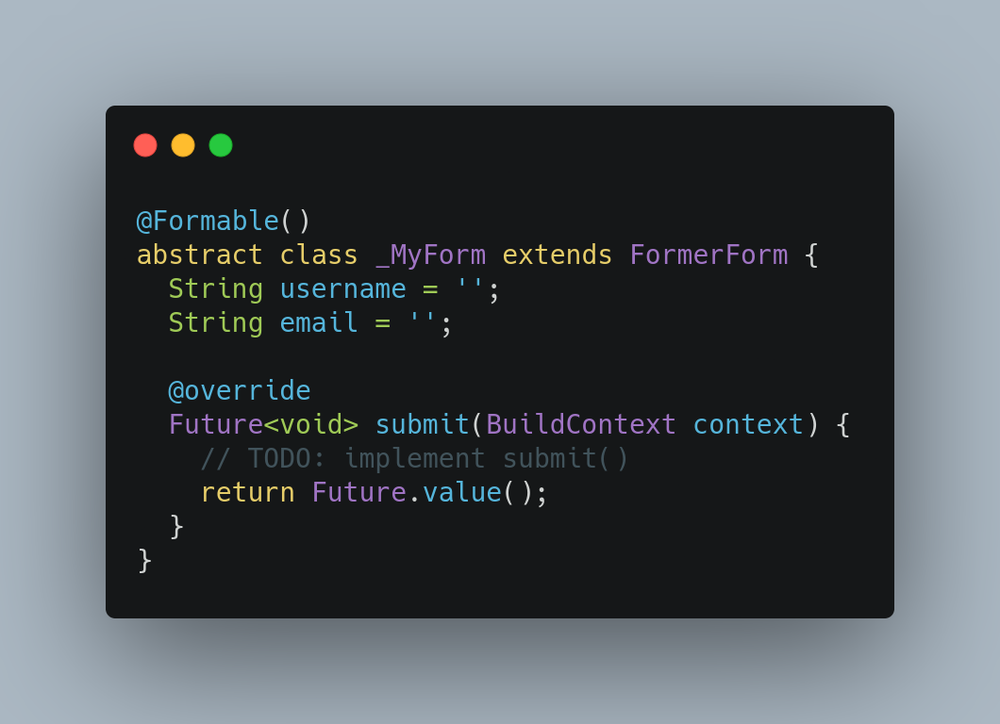

# [Work in progress] former

 

Easy form building in Flutter.

## Motivation

[Formik](https://formik.org/) is one of my favorite React libraries. It is a form library that drastically reduces
boilerplate for keeping track of field values, validation, and form submission.

Form building in Flutter suffers from similar issues:

- Developers have to manually keep track of field values, for example using `TextEditingController`s.
- Validation and error handling requires imperative logic.

This is where `former` comes in.

## Features

`former` provides the following features:

- Enabling/disabling form globally
- Declarative form validation
- Automatic value tracking via `Former` widgets
- Easy error handling with `FormerError` widget.
- Type-safe access of form.

## Usage

### Creating the form

`former` works by inspecting your form class and generating the corresponding code that makes it work with the `former`
API.

First, lets create our form class in `my_form.dart`:

```dart
import 'package:flutter_gen/flutter_gen.dart';

@Formable()
abstract class _MyForm extends FormerForm {
}
```

A couple of things to note:

- The form class is abstract and private. This is because some logic has to be mixed in before it is usable by `former`.
- The form class extends `FormerForm`. It interfaces our form class with `former` so that it can be used by `former`
  internals.

The `FormerForm` requires subclasses to implement the bracket operators. This is not needed in our abstract class
because that burden will be handled by `former`'s code generation. We only need to implement the `submit` method. For
example, it can include submitting your form to some API for further processing.

For simplicity's sake, our implementation of `submit` only returns an empty future value.

```dart
@Formable()
abstract class _MyForm extends FormerForm {
  @override
  Future<void> submit() {
    // TODO: implement submit()
    return Future.value();
  }
}
```

Let's also add some fields to our form:

```dart
@Formable()
abstract class _MyForm extends FormerForm {
  String username = '';
  String email = '';

  @override
  Future<void> submit() {
    // TODO: implement submit()
    return Future.value();
  }
}
```

Our form class is not usable until we mix in the generated mixin which makes the form "indexable" with the bracket
operator, and also contain type information of the fields in the form. Add the following before the class declaration:

```dart
class MyForm = _MyForm with _$MyForm;
```

...and add this:

```dart
part 'my_form.g.dart';
```

to import the generated code.

The Dart analyzer will complain about unrecognized symbols and imports. To fix it, start the code
generation via `build_runner`:

```
flutter pub run build_runner build
```

### Specifying the requirements

Imagine that our form has the following requirements:

- the username should be at least 10 characters long, but not longer than 50 characters.
- the email field, well, should contain a valid email.

Without `former`, this has to be done in an imperative way by, for example, checking the length of the string.
`former`'s super declarative API for specifying requirements makes everything easy and readable. All you have to do is
to create the schema class that is generated for you. In `my_form.dart`,

```dart
final schema = MyFormSchema(
  username: StringMust()
    ..hasMinLength(10)
    ..hasMaxLength(50),
  email: StringMust()
    ..beAnEmail(),
);
```

As you can see, the API is very self-explanatory. Note the use of the cascade operator `..` - in Dart, instead of
returning `this` for method chaining, the cascade operator `..` is preferred.

### Building form controls

`former` exports various widgets that interacts with the given form. To start, let's first create our form widget:

```dart
import 'package:flutter/material.dart';
import 'package:former/former.dart';

import 'my_form.dart';

class Form extends StatelessWidget {
  @override
  Widget build() {
    return Column(
      children: [
        FormerTextField<MyForm>(field: MyFormField.username),
        FormerTextField<MyForm>(field: MyFormField.email),
        ElevatedButton(
            onPressed: () {
              Former.of<MyForm>(context, listen: false).submit();
            },
            child: Text('Submit form')
        )
      ],
    );
  }
}
```

Our form contains two text fields that control the `username` and the `email` field respectively. The `MyFormField`
class is automatically generated for you, so you don't have to create one yourself.

When the button is clicked, `MyForm`'s `submit` method is called to submit the form. Beside submitting the
form, `Former.of(context)` gives you access to:

- the current form with `.form`. For example, you can access the current value of the username field
  with `Former.of<MyForm>(context).form.username`
- enabling/disabling the form with `.isFormEnabled` getter/setter. When a form is disabled, all the former controls
  controlling the form is automatically disabled as well.
- the error of a given field with `.errorOf(field)` which returns the error message as a result of a failed validation.
  It returns an empty string when the field is valid, or when no validation is performed yet.

This is an *extremely* simplified version of a form to showcase the widgets. Realistically, each Former control should
have a label describing what they do. In the future, there may be a widget that attaches a label to a Former control.
For now, it has to be done manually.

### Wrapping it all up

Finally, all we have to do is to wrap our form widget with the `Former` widget:

```dart
import 'package:flutter/material.dart';
import 'package:former/former.dart';

import 'my_form.dart';

class MyApp extends StatelessWidget {
  @override
  Widget build() {
    return MaterialApp(
      home: Scaffold(
        body: Former(
          form: () => MyForm(),
          schema: () => schema, // exported from my_form.dart
          child: _MyForm(),
        ),
      ),
    );
  }
}
```

### Source code

The full source code is available in the `example` folder.

## Available widgets

The following widgets are available for use with `former`:

- `FormerTextField`
- `FormerCheckbox`
- `FormerSwitch`
- `FormerSlider`

In development:

- `FormerRadio`
- `FormerDropdownButton`
